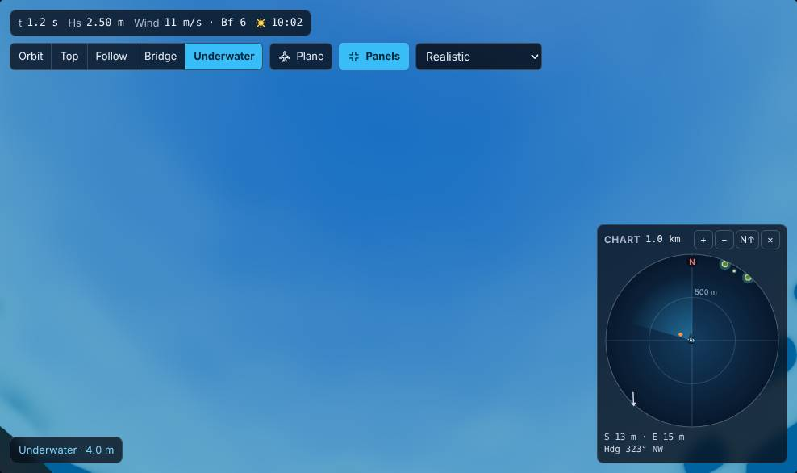
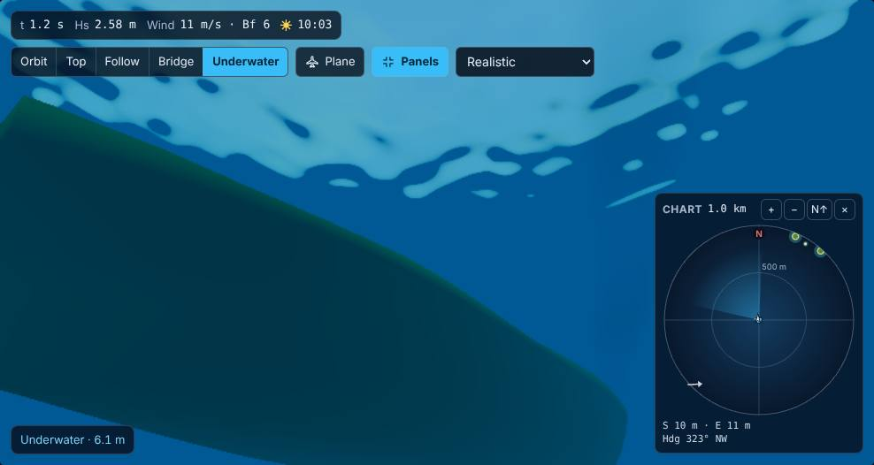
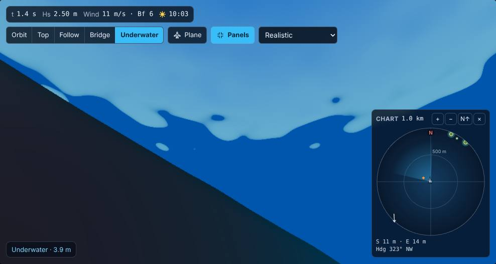
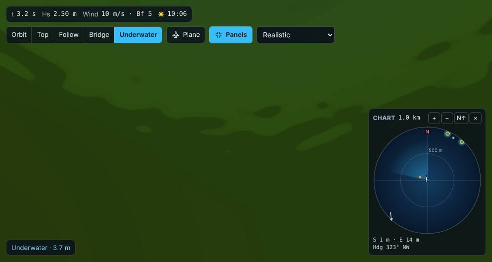

# Wave Laboratory

A real-time, scientifically grounded **3D ocean-wave sandbox**. Build a sea state from
oceanographic wave spectra, drop ships into it, and measure how they handle the waves.

**Live demo:** [https://exios66.github.io/wave-laboratory/](https://exios66.github.io/wave-laboratory/)

- **Waves:** JONSWAP, Pierson–Moskowitz and Bretschneider spectra, the TMA finite-depth
  correction, fetch-limited wind seas (Hasselmann et al. 1973) and regular Airy waves.
  Directional spreading is Mitsuyasu, cos-2s or Donelan–Banner. A uniform surface current
  Doppler shifts the whole sea and sets the ships. The dispersion relation
  includes finite depth and surface tension. The surface is synthesised from four FFT
  cascades (1 km swells down to centimetre ripples) with choppy (Lagrangian) displacement.
- **Rogue waves:** a NewWave focused group (Tromans et al. 1991) can raise a Draupner-class
  crest at a chosen place and time inside any sea.
- **Weather:** gusts drawn from the von Kármán turbulence spectrum and carried downwind as
  moving patches, squall fronts with a wind jump, veer and downpour, rain, cloud, fog and
  lightning. A wind sea can follow the weather so the sea builds and turns with the wind, and
  whitecap coverage follows Monahan's law. One-click situations go from calm to hurricane.
- **Ships:** 6-DOF rigid-body dynamics. Forces come from pressure integration over the
  instantaneous wetted hull (hydrostatics + Froude–Krylov), sampled on up to 280 water
  columns, plus added mass, radiation and viscous damping, propulsion, rudder and autopilot.
  Wind acts on every hull through its frontal and side areas, and the square-rigged pirate ship
  sails on the wind alone, bracing and reefing as the wind changes. The fleet runs from a
  lifeboat to a VLCC oil tanker and a Nimitz-class aircraft carrier. Slamming, green water and
  capsize are detected, and a collision or heavy slam can breach a watertight compartment that
  floods through the hole, costing stability (free surface) and eventually sinking the ship. A ship can drop anchor (or start moored to a buoy): an elastic
  catenary chain pulls at the bow, she weathervanes into the wind, and the anchor drags if the load
  beats its holding. The hull you see is lofted more finely than the physics mesh, with
  antifouling below the waterline, deck cargo and a foam wake that does not feed back into
  the forces. A loading setting (light ballast to overloaded) sets the displacement, and the
  ship floats at the matching draft.
- **Instruments:** wave gauges, vessel motion recorders, Welch spectra, zero-crossing
  statistics, motion-sickness incidence and CSV export.
- **What you see is what the ships feel.** The GPU renderer inverse-FFTs the same h₀ amplitudes
  the CPU physics uses. On each new sea it compares a texel with the CPU transform and logs an
  error if they disagree; the browser tests fail when that error appears.
- **View:** orbit, top, follow, bridge and underwater cameras. Drag to orbit and scroll or pinch to
  zoom. The Underwater camera hangs a few metres below the surface (scroll to change the depth,
  drag up to look into Snell's window) and works with or without vessels. Any camera that dips
  below the waves switches to the underwater look automatically, with a live depth badge. Light
  fades per colour with depth following the water type's K_d (red first in clear water, blue
  first in turbid coastal water), the surface seen from below shows the rippled sky inside the
  48.6° window and a mirror outside it, and hulls are seen from beneath.
  
  
  
  
  Overlays colour the surface by elevation, slope, or breaking and foam. Settings → Post-processing
  switches on bloom (sun, sun glint on the water, lightning), film grain and a vignette. They draw
  through an HDR target with ACES tone mapping applied once at the end; bloom is automatic on
  medium quality and above, but off on phones and software rendering.
- **Phones:** the 3D view fills the top half in portrait (side by side in landscape). A Scene /
  Inspector / Data switcher shows one panel at a time. The header keeps Presets and a More menu
  for the rest. Touch targets are at least 44 px, except the camera controls drawn on top of the
  view, which stay shorter so they do not cover the sea.
- **Accessible:** keyboard operable throughout, screen-reader labelled, WCAG 2.2 AA contrast,
  light and dark themes, reduced-motion aware. Accessibility is checked with axe on desktop and
  phone-sized viewports.

## Getting started

```bash
pnpm install
pnpm dev          # http://localhost:5173
```

Requires Node ≥ 22 and a browser with WebGL 2.

| Command                                        | What it does                                                                       |
| ---------------------------------------------- | ---------------------------------------------------------------------------------- |
| `pnpm dev`                                     | Development server with hot reload                                                 |
| `pnpm build`                                   | Type-check and build to `dist/`                                                    |
| `pnpm test`                                    | Unit tests (physics, analysis, schema, simulation)                                 |
| `pnpm validate`                                | Longer statistical physics validation suite                                        |
| `pnpm test:e2e`                                | Browser tests on desktop, Pixel 7 and iPhone 14 viewports (run `pnpm build` first) |
| `pnpm lint` / `pnpm typecheck` / `pnpm format` | Code quality                                                                       |
| `pnpm check`                                   | Format, lint, typecheck, unit tests and build in one go                            |
| `pnpm deploy:pages`                            | Build the site into `docs/` and commit it (Pages serves `main` / `docs`)           |

## Deploying the live demo (from `main`, no Actions)

There are no GitHub Actions workflows. Quality checks run locally (`pnpm check`, `pnpm test:e2e`).
The demo is the production build committed into [`docs/`](docs/) on **`main`**, beside the
markdown notes. The repository root holds only source and configuration; `index.html` there is
the Vite entry point used by `pnpm dev` and `pnpm build`.

1. `pnpm deploy:pages` builds the app and commits `docs/index.html`, `docs/404.html`,
   `docs/assets/` and `docs/.nojekyll` on the current branch. `--dry-run` builds the site into
   a temporary folder and changes nothing in the repository. Merge that commit to `main`.
2. Pages source: **Settings → Pages → Deploy from a branch → `main` → `/docs`**.

The site is served at `https://exios66.github.io/wave-laboratory/`. The build uses relative
paths, so it also works from any other static host or sub-folder.

## Using the lab

1. Pick a **preset** or start a **new** experiment. The built-in presets include a moderate
   sea with a container ship, a rogue wave meeting a ship, a hurricane with a tanker and a
   carrier, a pirate ship on a beam reach, a squall line, a North Sea winter storm, a Southern
   Ocean swell plus wind sea, a Wigley hull in a regular-wave tank, a box barge in beam seas,
   TMA swell in shallow water, and calm harbour ripples.
2. In the **Scene** panel, add wave systems, vessels and wave gauges. Select anything to edit
   it in the **Inspector**. Drag the edges of the 3D view to resize those panels and the data
   dock, hide a panel from its header, or press <kbd>V</kbd> to give the ocean the rest of the
   window (playback stays on a strip). The inspector shows the WMO sea state (from Hs rounded to the
   nearest centimetre), Beaufort wind, and model-validity warnings. Tapping a vessel or gauge
   on a phone opens the inspector. Select **Weather** in the Scene panel to pick a situation
   (calm to hurricane, squall line, fog bank) or tune gustiness, squalls, rain, cloud,
   visibility and lightning. The view shows the live wind and any squall or rain.
3. Use the **dock** to play, pause, step or change speed, and to view time series, spectra and
   statistics. Chart legends sit under each plot. Statistics can be exported as CSV.
4. **Save** the experiment as JSON, or **share** it as a link. Experiments are deterministic:
   the same file always produces the same sea. Theme and graphics quality are in **Settings**
   (also under the phone More menu).

A few secrets are hidden in the lab; old gamers and oceanographers will find them first.

Press <kbd>?</kbd> in the app for all keyboard shortcuts. On a phone, drag with one finger to
orbit and pinch with two fingers to zoom.

## Project layout

```
src/
  core/         maths, RNG, fixed-step clock, units
  schema/       versioned experiment format (Zod) and presets
  ocean/        dispersion, spectra, spreading, cascades, CPU FFT field
  vessel/       hull geometry, hydrostatics, hydrodynamics, wind loads, sails, control
  weather/      gusts, squalls, rain, lightning and weather presets
  instruments/  signal analysis (PSD, statistics, MSI)
  sim/          simulation kernel, Web Worker, client
  render/       Three.js/WebGL 2 renderer (GPU FFT ocean in render/ocean, vessels, cameras)
  ui/           React application
  test/         shared test fixtures
docs/           plan, physics reference, architecture, and the built Pages site
e2e/            Playwright browser tests
scripts/        deploy-pages.mjs (publishes the build into docs/)
index.html      Vite entry point
```

Unit tests sit next to the code they cover (`*.test.ts`); the longer physics validation suite
uses `*.validation.ts`. Tooling configuration (TypeScript, Vite, ESLint, Playwright) is in the
usual root files, and Prettier's settings live in `package.json`.

See [`docs/ARCHITECTURE.md`](docs/ARCHITECTURE.md), [`docs/PHYSICS.md`](docs/PHYSICS.md) and
[`docs/PLAN.md`](docs/PLAN.md).
